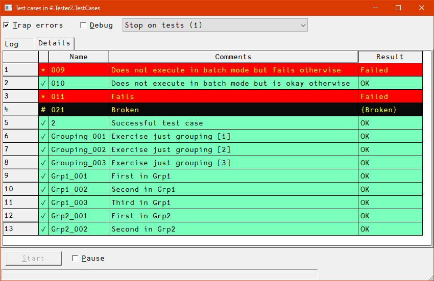

# Test framework for Unit tests in Dyalog APL

`Tester2` is a member of the APLTree library, which is a collection of classes etc. that aim to support the Dyalog APL programmer. (Search GitHub for "apltree" and you will find solutions to many every-day problems Dyalog APL programmers might have to solve)

If you are using the predeccessor `Tester` and want to migrate to `Tester2` then please read the document `Tester2VersusTester.html`.

**Note:** `Tester2` releases are published as [Tatin](https://tatin.dev "Link to the principal Tatin Registry") packages, see there.

## Overview

The framework comprises two classes:

* `Tester2` is a class required to manage and execute test cases.
* `CodeCoverage` is needed if you want to produce a code coverage report, something that is recommended.

The purpose of `Tester2` is to provide a framework for testing all the projects of the APLTree library. Only with such a framework is it possible to make changes to any APLTree project with confidence.

You might find the framework flexible enough to suit your own needs when it comes to implementing tests, even independently from the APLTree library.

Depending on how the Test framework is used it might or might not present a GUI. Note that the GUI is a Windows-only feature (at least for the time being) although in all other respects `Tester2` works on all platforms; if you decide to avoid the GUI, messages are printed to the Dyalog session window.

The GUI was mainly introduced for `Tester2`'s own sake: `Tester2` is used to test itself, and the messages printed to the session can be very confusing while the GUI is clean even then.

However, executing a large test suite with the GUI is significantly slower than doing the same without the GUI.

If the GUI shows that's how it looks like:


The "Log" tab shows all the messages the `Tester2` class provides:

* Whether there were any INI files instantiated
* Whether a function  `Initial` was found and executed
* Which test cases got examined and possibly executed
* What the overall picture is:
  * Number of test cases executed
  * Number of test cases that crashed
  * Number of test cases that failed
  * Number of test cases that were inactive
  * Number of test cases that were not applicable
  * Number of test cases that are designed to run on different platforms
* Whether  a function  `Cleanup` was found and executed

The "Details" tab shows a list of all test cases with...

1. the status in the first column
2. the name (but without `Test_`) in the second column 
3. the first comment line in the third column
4. the symbolic name of the return code, like `Failed` or `WindowsOnly` etc. in the fourth column.



The status column shows:

* `✓` okay
* `*` failed
* `#` broken
* `⍝` inactive

Different statuses show in different colours.

After all test cases got processed the user might interact with the GUI. These are the commands presented by the context menu:


Note that all `Run*` functions return  a two-element vector:

  1. [1] is a return code (`rc`) with 0 for "okay".
  2. [2] is an empty vector in case `rc` is 0 and might contain additional information in case `rc` is not 0.


A reference pointing to the GUI is assigned internally. That's why the GUI does not disappear straight away after all test cases have been executed. To get rid of it either click the "Close" box or call the `T.CloseGUI` method which does not require an argument.


## Details 


### Terminology

Note that test cases causing a crash are considered "broken". Test cases that do not return the expected result are considered "failing".


### Assumptions and preconditions

1. The `#.Tester2` class assumes that all your tests are hosted by a namespace. It may be an ordinary (recommended) or a scripted namespace, but it **must not** be an unnamed namespace. 

1. You must create an instance of the `Tester2` class in order to do anything useful. This is _the_ major difference to the now deprecated `Tester` class.

   The constructor demands a right argument: that must be a reference to the namespace that hosts all your test cases.

   Example: given that all your test cases live in `Foo` then you could create an instance `T` with: `T←⎕NEW Tester2 Foo`

1. All test functions inside their namespace are expected to start their names with `Test_` followed either by some digits or a group name followed by an underscore followed by some digits, for example `Test_Foo_003`.

   It is recommended that in case you use groups you assign _all_ your test cases to groups.

1. The number of digits you use for numbering is not restricted: `Test_foo_1` is fine, and so is `Test_foo_0000001`. However, they should be consistent, at least within a group.

1. In each test function the first line after the header (which includes any lines that start with a `;`) must carry a comment telling what is actually tested.

   Keep in mind that later this is the only way to tell one test case from the others without reading the code, so be as clear as you can possibly be, but be also brief. 

   You are restricted to a single line, and you should keep it short enough to be displayed with a reasonably setting of `⎕PW`.


### Executing test cases

There are some typical scenarios:

* Run _all_ test cases, with or without error trapping and with or without stop flag: see the function `Run`.
* Run only a _subset_ of all test cases,  with or without error trapping and with or without stop flag: see the function `RunThese`.
* Run _only "batchable"_ test cases, with or without error trapping and with or without stop flag: see the function `RunBatchTests`.
* Run _all_ test cases _with a GUI_, with or without error trapping and with or without stop flag: see the function `RunGUI`.

All these functions call the function `Run__` under the hood, which means that this is a generalized all-singing all-dancing function. If none of the above functions fulfil your needs consider calling `Run__` yourself.


### Definitions

#### Error trapping (`trapFlag`)

Traps all errors except that is does not influence the workings of the `debugFlag`.

#### Debugging (`debugFlag`)

If this flag is 0 any failing test within any test function just makes the test function quit, returning a return code that has the symbolic name `_Failure`. See [Symbolic names](#symbolic-names) for details.

If this is 1 (`_OK`) then any failing check crashes right on the spot. This allows one to investigate what went wrong, and why.

#### Suspend execution (`stopFlag`)

This makes the test framework stop just before the next test function is about to be executed. This allows you to trace test cases from top to bottom.

#### Batchable tests

These are tests that do not need a human in front of the monitor. Ideally all tests should be "batchable" of course. However, in real life this is not always possible for technical reasons, or the effort would be just too high.

Note that all test cases get the `batchFlag` provided as part of the right argument, so they know what's required, and can act accordingly.
    


### The syntax of test functions

1. Every test function must accept a right argument which is a two-item vector of Booleans:

   1. `debugFlag`; 1 means that the test function runs in debug mode.

      Assuming that all tests use the [flow control functions](#flow-control) provided by `Tester2` the difference is that with `debugFlag` being 0 the test function would finish and return the symbolic name `Failure` while with `debugFlag` being 1 the test function would crash on the spot when a particular check fails, allowing the user to investigate right away.

   1. `batchFlag`: 1 means that there is no user available in front of the monitor.

      That allows a test function that requires a human for confirmation or some action to _not_ carry out the test but return the symbolic name `_NoBatchTest`.

1. Every test function must return a result. You are advised to assign one of the symbolic names defined as read-only fields every instance of `Tester2` comes with. This is much more readable than a simple integer, and it is easier to find as well. See [Symbolic names](#symbolic-names) for details.


### Groups

You will find that test cases need to be kept simple, and should not depend on each other (see [Best Practices](#best-practices)). That leads easily to a significant number of test cases in case you throw it at something complex like, say, [MarkAPL](https://github.com/aplteam/MarkAPL).

It is pretty easy to get lost in a large number of test cases, less so when writing the first ones but more so when later you need to delete obsolete test cases, add new test cases for new features or fixed bugs and make changes to test cases that need, well, changing.

That's why groups are quite important: they allow you to order test cases hierarchically.

It is also possible to execute all test cases belonging to a particular group with a single command.

Note that you can have group-specific [initialization ](#initialisation-for-groups) and [cleaning up](#cleaning-up-for-groups).

You may also specify more than one group by...

* providing a comma-separated list of them
* use `*` as a wildcard character for matching one or more groups


You may also exclude one or more groups by starting the definition with a tilde (`~`) character ("without").


### Custom constants

Although there are quite a number of symbolic names available to give feedback for many foreseeable problems (like a test that can run only on a certain platform,) there will always be circumstances that cannot be foreseen. Therefore `Tester2` allows you to define up to 9 custom constants.

Custom constants are named from `custom_1` to `custom_9`. They are initialized with `''`. In order to use one you must assign a simple character vector. This character vector is shown in the "Result" column of the GUI etc.

An example would be (assuming that `T` is an instance of the `Tester2` class): 

```
T.custom_1←'Invalid version of Dyalog APL'
```

### Checks before and after a test case is executed

#### Application

Imagine that a few of a large set of test cases leave behind files in the temp folder, and you have no idea which one it is. Obviously that is easy to find out when you check right after a test case was executed.

That's why `exec_before_each_test` and `exec_after_each_test` were added as properties with version 1.1 to `Tester2`: they allow you to check whatever you want either just before or right after a test case was executed.

Another application is when a test case causes a sys error (aplcore) but it is not that particular test case that is causing the real problem but an earlier one. In that case you can execute `2 ⎕NQ'.' 'wscheck'` after each test case, forcing the interpreter to perform a workspace integrity check; that will bring you much closer to the real culprit.

I found many other applications for this over the years.

#### Overview

When specified they must be the fully qualified name of a monadic function that may or may not return a result.

The right argument will be a two-element vector:

1. The name of the test function that is about to be executed (in case of `exec_before_each_test`) or was just executed (in case of `exec_after_each_test`). You might need to keep `⎕TRAP` local for this.

2. A namespace with all the parameters.

Regarding the result there are two options:

* In case no result is returned you need to make sure you make the function stop in case you find something not to your liking, or print a message to the session if that's sufficient.
* In case the function returns a result it must be a text vector. If that text vector is empty then `Tester2` does not take any action. If it is a simple string this string will be printed to the session. Then `Tester2` carries on.


## Work flow

No matter which of the `Run*` functions you are going to call, the workflow is always the same. (There is a minor difference when `Run__` is used; this will be discussed later)


### Create an instance

First you need an instance. Let's assume that you have a project in `#.Foo` and that the project's test cases are hosted by the namespace `#.Foo.TestCases`. You create an instance with:

```
      T←⎕NEW #.Tester2 #.Foo.TestCases
```

From then on, all `Run*` functions, all symbolic names and all other helpers are available via the instance `T`. Some examples:

```
      T.RunGUI ⍬
      T._OK
      T.PassesIf
      T.⎕nl -3    ⍝ Produces a list of all public instance methods
```

When you call one of the `Run*` functions the same steps are executed:


### INI files (optional)

Note that there is an instance property `IniFolder`. By default this points to `CiderConfig.HOME` if a namespace `CiderConfig` can be found in the namespace that hosts the test cases or its parent.

If there is no such namespace the default falls back to the current directory.

If your INI file(s) do not live in either place then you must set the `IniFolder` property in order to allow `Tester2` to find the INI file(s).

First the `Run*` methods check whether there is a file `testcases.ini`. If this is the case that INI file is processed. Use this INI file to specify general stuff that does not depend on a certain computer/environment.

Then the `Run*` methods checks for a file `testcases-{computername}.ini`. If this file exists it is processed. Use this to specify stuff that does depend on a certain computer or environment.

Note that if one or both of the two INI files exist there will be a _flat_ namespace `T.INI`, meaning that any sections defined in the INI file(s) will be ignored. 

An example: if your test functions are hosted by a namespace `Foo.TestCases` and your INI file specifies a variable `hello` as holding "world" and you have created an instance with the name `T` inside `#.Foo.TestCases` then:

```
       'world'≡#.Foo.TestCases.T.INI.hello
1
```


### Initialisation

In the next step the `Run*` method checks whether there is a function `Initial` in the hosting namespace. If that is the case then this function is executed.

Note that the function must be either niladic or monadic, and it may return no result at all or a Boolean result. A 1 means that function did what it is supposed to do (=same as no result) while a 0 means it could not initialize (success flag).

Of course, you can simply execute `→` on a single line in your `Initial` function if any requirement is not met, but that would also mean that if you run your test cases automatically as part of, say, an automated build process, then this would disrupt the workflow. (There are other reasons why this is not a great idea)

In such cases `Initial` should return a 0 indicating failure. Also, part of the initialization might have been carried out, and a function `Cleanup` (discussed in a second) might get rid of any left-overs.

If the function is monadic then a reference pointing to the parameter space is passed as the right argument. By checking this parameter space `Initial` can, for example, find out whether the `batchFlag` is set or not. 

You may also put a variable inside that namespace which can later be referenced by the `Cleanup` function. However, in order to avoid name clashes you are advised to start the names of such variables with a `⍙` or a `∆` character. 

Use `Initial` to create stuff that's needed by **all** test cases, or tell the user something important (only if the batch flag is false of course).

Notes:

* You can have separate [`Initial` functions for specific or all groups](#initialisation-for-groups). Use this to initialize stuff that is only needed for a certain group, like a database connection etc.

* After executing all test cases `Tester2` will look for a function `Cleanup` in the hosting namespace. If there is such a function it will be executed.

  Of course you can also have [group-specific `Cleanup` functions](#Cleaning up for groups).

### Initialisation for groups

You can have initialisation functions for groups. It's recognized by naming convention: for a group `foo` the function's name must be `Initial_foo`. 

The rules are exactly the same as for the [global `Initial` function](#initialisation), although the consequences are different:

When `Initial_foo` returns a Boolean and that is a zero, then no test function belonging to the group `foo` will be executed but `Tester2` will carry on executing other test cases.

### Finally: running the test cases

Now the test cases are executed one by one, or, if groups are defined, one group after the other.


### Cleaning up

After the last test case was executed the `Run*` function checks whether there is a function `Cleanup` in the namespace hosting your test cases. If that's the case then this function is executed. 

Any `Cleanup` function should either return a shy result (which will be ignored) or no result at all. It might accept a right argument, but this is optional: it might as well be niladic. If it _does_ accept a right argument it will get the parameter namespace passed.

Note that a function `Cleanup` would be executed no matter whether there was or was not a function `Initial`, and if there was, no matter whether it returned a 0 or a 1 or nothing at all.

### Cleaning up for groups

You can have clean-up functions for groups. It's recognized by naming convention: for a group `foo` the function's name must be `Cleanup_foo`. 

The rules are exactly the same as for the [global `Cleanup` function](#initialisation).

Naturally a group-specific `Cleanup` function is called after the last test function of that group got executed.


### INI file again

Finally, the namespace `INI` holding variables populated from your INI file(s) is removed from the instance.


### Premature exit

There might be situations when you've executed some but not all test cases and now you want to exit the test framework, typically while you are in a test function. Now the obvious choice is )Reset, or execute just `→`.

However, there are situations when you need things to be cleaned up, like closing file, deleting folder, shutting down a server and stuff like that.

In such a case the framework should clean up (execute any `Cleanup` function) etc.

This can be achieved by calling the instance method `QuitTests`. This function signals a `QuitEvent` which is trapped and processed in a specific way by the test framework.


### Make the test framework stop 

`Tester2` allows you to stop at strategic important points in time. 

#### Stopping on a test function

You might want to trace trough a test function from top to bottom. That can be achieved by passing a 1 as left argument to any of the `Run*` functions. The test framework will stop just before the test function(s) get executed.

#### Stopping on `Initial` function(s)

You can force `Tester2` to stop just before any `Initial` function gets executed. That can be achieved by passing a 2 as left argument to any of the `Run*` functions. 

#### Stopping on `Cleanup` function(s)

You can force `Tester2` to stop just before any `Cleanup` function gets executed. That can be achieved by passing a 4 as left argument to any of the `Run*` functions. 

#### Mixing stops

You may mix things up. For example, to make `Tester2` stop on every `Initial`, every test and every `Cleanup` function just specify the total : `1+2+4 = 7`

Any other combination (3, 5, 6) is valid as well.

#### Stops with the GUI

Note that the GUI provides a combo box with all possible values:


## Code coverage

Usually one would like to know how much of the code is actually covered by test cases. Ideally that should be 100%, but that is rarely achievable.

However, in order to improve on this, one needs to know how much code is covered, and also which parts of the code are _not_ covered.

Since version 2.3 `Tester2` can cooperate with the class [CodeCoverage](https://github.com/aplteam/CodeCoverage) which is capable of collecting the necessary data and compile a report from them. 

If you want `Tester2` to cooperate with `CodeCoverage`, assign a reference pointing to an instance of `CodeCoverage` to the `Tester2` property `codeCoverage`.

## Instance stuff offered by `Tester2`

The methods fall into four groups:


### Running test cases

`Run`, `RunBatchTests`, `RunGUI`, `RunThese` and `Run__` are running all or selected test cases with or without error trapping.


### Flow control

`FailsIf`, `PassesIf` and `GoToTidyUp` control the program flow in test functions. The test template (see [`GetTestTemplate`](#test-function-template) for details) contains examples for how to use these functions.

These functions return a result (Boolean) in case `debugFlag` is a 0 but make the calling `Test_*` function crash otherwise, allowing you to investigate a failing test case right on the spot. Note that the setting of the `trapFlag` has no bearing on this.

This is achieved by the functions `FailsIf`, `PassesIf` and `GoToTidyUp` signalling an error 999 that can be trapped with, say:

```
      ⎕TRAP←(999 'C' '∘∘∘ ⍝ Deliberate error')(0 'N')
```

That's why the template for a test function carries such a statement _and_ keeps `⎕TRAP` local.

Note that `GoToTidyUp` allows you to jump to a label `∆TidyUp` with a statement like:

```
 →GoToTidyUp ~expected≡result
```

This is useful in case a test case needs to do some cleaning up like deleting a temporary file created by the test case, so just jumping out is not an option In case the right argument is 1 (rather than 0) it causes a crash in debug mode and carries out the jump otherwise.


### Test function template


You can get a test function template by calling the instance method `GetTestTemplate`. 

You must provide a number as right argument. The test function will be named `Test_{yourNumber}`. The number must be between 1 and 999 and will be formatted to a three-character vector.

You can also provide a group name via the optional left argument. 

Check the examples which assume that an instance of `Tester2` is available as `T`, and that you are inside the (ordinary, non-scripted) namespace that hosts the test cases:

```
      ⊃⍴'T'⎕NL 3
0
      T.GetTestTemplate 3
Test_003
     ⊃⍴'T'⎕NL 3
1
      'Misc' T.GetTestTemplate 1
Test_Misc_001
     ⊃⍴'T'⎕NL 3
2
```

Note that in case such a test function already exists  it will be overwritten, but first you will be prompted for confirmation.

Note that for technical reasons such a template function cannot be established by `GetTestTemplate` when the namespace hosting the test cases is scripted. If that is the case you will be prompted for copying the code to the clipboard; it is then up to you to insert the code into the script.


### Symbolic names

These are the public read-only instance fields that act like constants:


| Name                   | Meaning                                                                     |
|------------------------|-----------------------------------------------------------------------------|
| `_OK`                  | Passed |
| `_Failed`              | Unexpected result|
| `_NoBatchTest`         | Not executed because `batchFlag` was 1.|
| `_NotApplicable`       | This test is not applicable here and now |
| `_NotImplemented`      | Attempts to test a feature that has yet not been implemented |
| `_InActive`            | Not executed because the test case is inactive (not ready, buggy, ...) |
| `_IncompatibleVersion` | Regarding the version of Dyalog currently running |   
| `_LinuxOnly`           | Not executed because runs under Linux only|
| `_LinuxOrMacOnly`      | Not executed because runs under Linux/Mac OS only|
| `_LinuxOrWindowsOnly`  | Not executed because runs under Linux/Windows only|
| `_MacOrWindowsOnly`    | Not executed because runs under Mac OS/Windows only|
| `_MacOnly`             | Not executed because runs under Mac OS only|
| `_NoAcreTests`         | Not executed because it's acre related but acre is not around|
| `_NoCiderTests`        | Not executed because it's Cider related but Cider is not around|
| `_NoCiderTest`         | Not executed because it's Cider related
| `_WindowsOnly`         | Not executed because runs under Windows only|

Use these to assign an explicit result within any test function. The advantages of this approach:

1. Much more readable than an integer.
2. You can easily search for, say, `_InActive`.

Notes:

* There is a method `ListSymbolicNames` available that lists all symbolic names.
* By putting a comment on the line where a constant is assigned you can make sure that this comment is, together with the name of the constant, put into the GUI's "Result" comment.

  For example, assuming that `Tester2` was instantiated with `T←⎕NEW Tester2`, then this:

  `R←T._Inactive ⍝ Waiting for fix for bug 1291`

   would pop up as "Inactive: Waiting for fix for bug 1291" in the "Result" column for the associated test function.

### Helpers

These are functions that are not actually required in order to run test cases but can make a programmer's life significantly easier.

These functions are discussed in detail at [Managing test cases](#managing-test-cases).

## Examples

### `Tester2`'s `Run*` functions

#### `Run`

Run requires a Boolean right argument. A 1 makes the test framework stop on a line that fails to return the expected result (`PassesIf`, `FailsIf`, `GotoTidyUp`) while a 0 does not.

The optional left argument must also be Boolean and defines whether the `Run` function should stop right before any of the test cases is executed (1) or not (0, which is the default).

#### `RunGUI`

With `RunGUI` you can achieve the same as with `Run` but it is a Windows-only feature. It might be easier to start with `RunGUI` but you might switch to `Run` later, if only because it is significantly faster.

However, there are situations when `RunGUI` is indispensable: `Tester2`'s own test cases are almost impossible to follow without it, for example. It's also useful in order to demonstrate the features of the `Tester2` class.

`RunGUI` requires only a right argument; if this is empty _all_ test cases will be executed. You can specify numbers or a group name or mix a group name with one or more numbers. You can also precede a group name with a `~` (without) in order to execute all test cases but the members of that group.

Notes:

* You can specify only _one_ group name.
* The GUI can be closed programmatically by calling the niladic instance method `CloseGUI`.
* You can create a parameter space by calling `CreateParms`, make amendments and pass the parameter space as the optional left argument to `RunGUI`. However, since you can make those amendments in the GUI itself this is useful only to specify defaults for the GUI.

#### `RunThese`

This method is particularly helpful while developing/enhancing stuff: the function allows you to run just selected test functions rather than a whole test suite.

If you now think, well, why not just call any function `Test_001` myself then imagine a situation when all your test cases depend on an INI file or the execution of `Initial` or both. That is exactly the advantage of `RunThese`: it carries out all these steps for you, and also executes the `Cleanup` function in case there is one.

`RunThese` offers the following options:

```
T.RunThese 1                 ⍝ Execute test cases 1 that do not belong to any group
T.RunThese 'Group1'          ⍝ Execute all test cases belonging to Group1
T.RunThese '~Group1'         ⍝ Execute all tests but those belonging to Group1 (without)
T.RunThese 'Group1' (2 3)    ⍝ Execute test cases 2 & 3 of Group1
T.RunThese 'Group1' 2 3      ⍝ Same as before
T.RunThese 'Misc'            ⍝ Execute all test cases of the group "Misc"
T.RunThese 'L*'              ⍝ Execute all test cases of all groups starting with "L"
T.RunThese 'Group1_001'      ⍝ Executes just this test case
T.RunThese 'Test_Group1_001' ⍝ Same as before
```

Note that you can specify only one group.

Sometimes you want to trace through test cases. This can be achieved be specifying a 1 as the (optional) left argument. `RunThese` would then stop just before any test case is actually executed, after processing any INI file(s) and executing any `Initial` function.


### `RunBatchTests`

This is the same as `Run` except that it passes a 1 as `batchFlag` to the test functions. This allows the test function itself to _not_ run any tests. This is usually because a test requires a human in front of the monitor, and if such a human is not available right now then there is no point running such tests.


### `Run__`

This is a generalized function that is effectively called by all the other `Run*` functions. In case the other functions don't suit your needs, you can use it yourself, although it requires a little more effort:

```
      ps←T.CreateParms ⍬
      ps._∆List  ⍝ List the defaults
 batchFlag    0 
 debugFlag    0 
 guiFlag      0 
 stopFlag     0 
 testCaseNos    
 trapFlag     1 
      ⍝ Make amendments:
      ps.stopFlag←1
      ps.testCaseNos←'Misc' (1 2 3)
      ⍝ Call the Run__ function:
      (rc log)←T.Run__ ps
```

### Managing test cases 

There are a couple of methods available that assist you in managing test cases.

The examples stem from the `Fire` project (<https://github.com/aplteam/Fire>).

#### Listing groups

`ListGroups` lists all groups:

```
      ListGroups
acre
Cider
InternalMethods
List           
Misc           
Replace        
ReportGhosts   
Search 
```


#### Listing symbolic names

`ListSymbolicNames` lists all symbolic names:

```
      ListSymbolicNames
 _Failed             
 _Inactive           
 _LinuxOnly          
 _LinuxOrMacOnly     
 _LinuxOrWindowsOnly 
 _MacOnly            
 _MacOrWindowsOnly   
 _NoAcreTests        
 _NoBatchTest        
 _NotApplicable      
 _NotImplemented
 _OK                 
 _WindowsOnly        
```


#### Listing test functions

`ListTestFunctions` requires a right argument (empty or group name) and accepts an optional left argument (test case numbers).

```
      ⍴ListTestFunctions ''
99 150
        
      ListTestFunctions 'Li*'
Test_List_001             Unnamed NSs & GUI instances are ignored.                                        
Test_List_002             Just GUI instances are ignored                                                  
Test_List_003             Nothing is ignored at all; instances of GUI objects are ... 
Test_List_004             Nothing is ignored but class instances                                          
Test_List_005             Scan all object types but with "Recursive" ← None                                 
Test_List_006             Scan all object types but with "Recursive" ← Just one level                       
Test_List_007             Search for "Hello" with a ref and an unnamed namespace                          
    1 7 99 ListTestFunctions 'List'
Test_List_001             Unnamed NSs & GUI instances are ignored.               
Test_List_007             Search for "Hello" with a ref and an unnamed namespace   
      ⍴ListTestFunctions''
99 2
```

With a large number of test cases you might prefer to get them into an edit window rather than printing them to the session. This can be achieved by this command:

```
'view' ListTestFunctions ''
```

Notes:

* Group names must be specified fully or you must specify an asterisk at the end.
* Test case numbers that do not exist are simply ignored.
* The result is a matrix with two columns: names in the first column and the first line after the header in the second column.

#### Editing test cases

Occasionally you might want to edit some or even all test case functions. That can be easily achieved: 

```
EditTestFunctions''                          ⍝ Edit all test cases
EditTestFunctions T.ListTestFunctions'ZZZ'   ⍝ Edit all test cases of the group "ZZZ"
      
```

#### Rename a test function

Renaming a test function is actually harder (and more dangerous) than you might think at first glance, hence the method `RenameTestFnsTo` is there to assist you.

The syntax:

```
'oldname' T.RenameTestFnsTo 'newname'
```

Let's assume that at first you started numbering your test functions. Soon you come to realize that groups would be helpful. But it is awkward to have some test functions carrying just numbers and others group names _and_ numbers. Therefore, it is the good idea to rename those with just a number into, say, `Test_Misc_` followed by the number.

For example:

```
'Test_001' T.RenameTestFnsTo 'Test_Misc_001'
```

`RenameTestFnsTo` does a couple of things for you:

1. It copies `Test_001` to `Test_Misc_001`
1. It cooperate with code management systems
   * If [acre](https://github.com/the-carlisle-group/Acre-Desktop) is around it tells acre about the introduction of `Test_Misc_001`
   * If Link version 3.0.0 or better is available it is told about the introduction of `Test_Misc_001`
1. It deletes the function `Test_001`
1. It tells acre (if it's around) and Link (if at least version 3.0.0 is available) about the deletion of `Test_001`

Note that with version 2.2 `RenameTestFnsTo` has learned to deal with groups as well. For example:

```
'Foo' T.RenameTestFnsTo  'Misc'
```

Assuming that there is a group "Foo", then all members of that group would be renamed, so that they become members of the group "Misc".

If there is already a group "Misc" then numbering would start with the highest previous number plus 1.


## Best Practices

* When starting to implement test cases you are advised to leave gaps: `Test_001`, `Test_010` etc. The same holds true for numbering within groups.

* Try to keep your test cases simple and test just one thing at a time, for example just one method at a time. 

* For more complex methods (for example when the method accepts different kinds of arguments) create a group with the method name as group name.

* Create everything you need on the fly and tidy up afterwards. Or more precisely, tidy up (leftovers!), prepare, test, tidy up again. In other words, make the test case "stand-alone".

  The exception from this rule is when _all_ test cases require the same pre-condition like, say, a database connection. In that case establish what's needed in a function [`Initial`](#initialisation) and use a function [`CleanUp`](#cleaning-up) to get rid of it.

  If all test functions of a certain group share the same requirement use [Initialisation for groups](#initialisation-for-groups).

* Avoid a test case relying on changes made by an earlier test case. This can be a tempting thing to do, but you will almost certainly regret this later.

* Notice that the DRY principle (don't repeat yourself) can and should be ignored when it comes to test cases: any test case should read from top to bottom like an independent story that can be understood by itself.

* It might  be a good idea for _all_ test functions to tidy up first, just in case this test case has failed earlier and left some debris behind.

* It's probably a good idea to implement for every fixed bug a separate test case, for bugs tend to make comebacks all the time, and such a test case would discover such a comeback.
