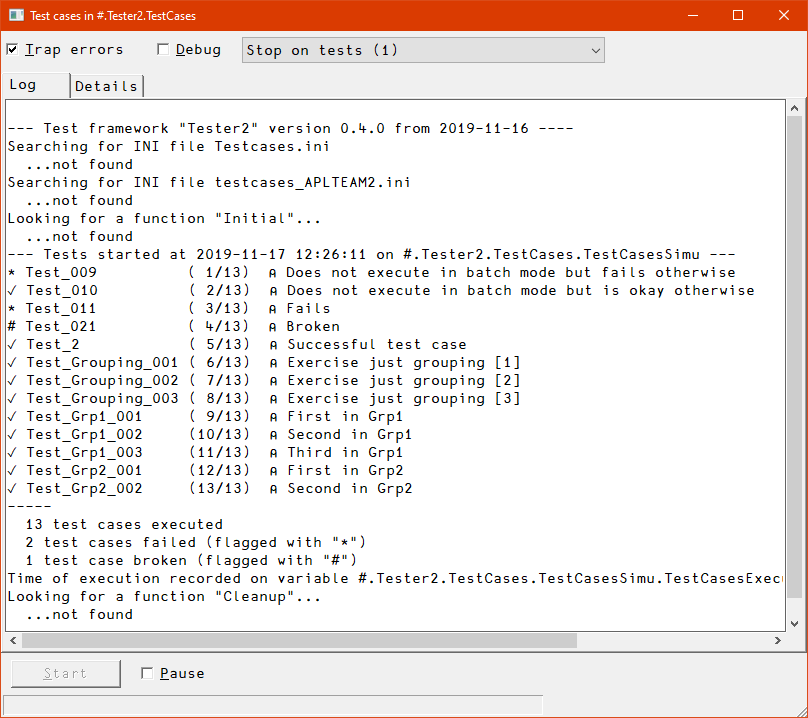
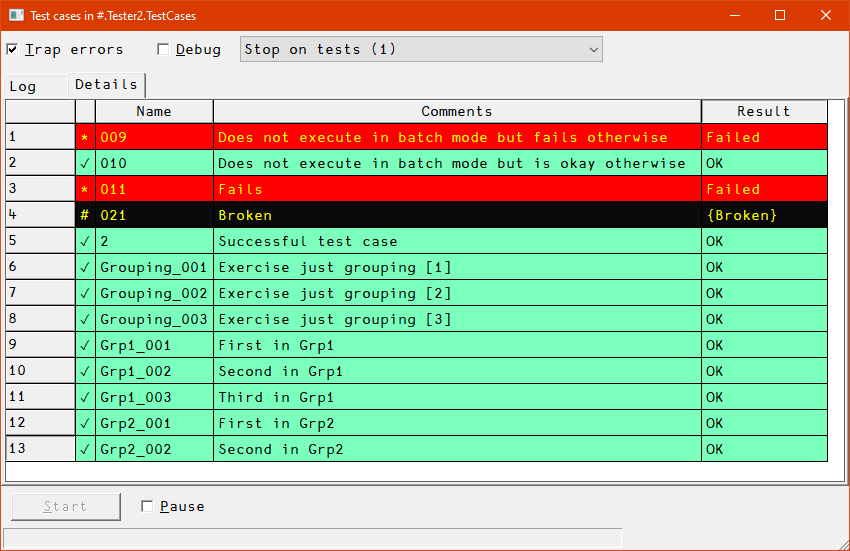
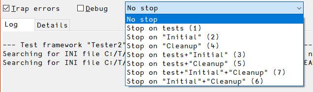

[parm]:leanpubExtensions = 1
[parm]:title             = 'Tester2 Reference'
[parm]:toc               = 2 3 4 5 6
[parm]:width             = 1100


# Tester2 User Manual

## Overview

The framework comprises the class `Tester2` which comes with functions designed to manage and execute test cases. 

`Tester2` cooperates with the class `CodeCoverage`, which is designed to produce a code coverage report, which is recommended.

Both `Tester2` and `CodeCoverage` can be loaded as Tatin packages.

`Tester2` was originally implemented as a framework for testing all the projects of the APLTree library, but became quickly a general solution.

You are likely to find the framework flexible enough to suit your own needs when it comes to implementing tests.

Depending on how the Test framework is used it might or might not present a GUI. Note that the GUI is a Windows-only feature although in all other respects, `Tester2` works on all platforms; if you decide to avoid the GUI, messages are printed to the Dyalog session window.

The GUI was mainly introduced for `Tester2`'s own sake: `Tester2` is used to test itself, and when used without the GUI the messages printed to the session are pretty confusing, while the GUI gives you proper feedback even in that scenario.

Note that executing a large test suite with the GUI is significantly slower than doing the same without the GUI.

You are advised to not use the GUI except when you...

* to develop `Tester2` itself
* to familiarize yourself with Tester2`

`Tester2` can easier be explained by using the GUI, so in this document it is used.

This is how the GUI looks like:



The "Log" tab shows all the messages the `Tester2` class provides:

* Whether there were any INI files instantiated
* Whether a function  `Initial` was found and executed, and what it returned, if anything
* Which test cases got examined and possibly executed
* What the overall picture is:
  * Number of test cases executed
  * Number of test cases that are broken 
  * Number of test cases that failed
  * Number of inactive test cases
  * Number of test cases that were not applicable
  * Number of test cases designed to run on different platforms
* Whether a function  `Cleanup` was found and executed

The "Details" tab shows a list of all test cases with...

1. the status in the first column
2. the name of the test function (but without `Test_`) in the second column 
3. the first comment line of the test function in the third column
4. the symbolic name of the return code, like `Failed`, `OK` or `WindowsOnly` etc., in the fourth column, or `{Broken}` if that test crashed.



The status column shows:

* `✓` okay
* `*` failed
* `#` broken
* `⍝` inactive

Different statuses show in different colours.

After all test cases got processed, the user might interact with the GUI. These are the commands presented by the context menu:


Note that all `Run*` functions return a two-element vector:

  1. [1] is a return code (`rc`) with 0 for "okay".
  2. [2] is an empty vector in case `rc` is 0 and might contain additional information in case `rc` is not 0.


A reference pointing to the GUI is assigned internally. That's why the GUI does not disappear straight away after all test cases have been executed. To get rid of it either click the "Close" box or call the `T.CloseGUI` method which does not require an argument.

## Details 

### Terminology

Note that test cases causing a crash are considered "broken". Test cases that do not return the expected result are considered "failing".


### Assumptions and preconditions

1. The `Tester2` class assumes that all your tests are hosted in a namespace. It may be an ordinary (recommended) or a scripted namespace, but it **_must not_** be an unnamed namespace. 

1. You must create an instance of the `Tester2` class to do anything useful. 

   The constructor demands a right argument: that must be a reference to the namespace that hosts all your test cases.

   Example: given that all your test cases live in `Foo`, then you could create an instance `T` with: `T←⎕NEW Tester2 Foo`

1. All test functions inside their namespace are expected to start their names with `Test_` followed either by some digits or a group name followed by an underscore followed by some digits, for example, `Test_Foo_003`.

   It is recommended that in case you use groups you assign _all_ your test cases to groups.

1. The number of digits you use for numbering is not restricted: `Test_foo_1` is fine, and so is `Test_foo_0000001`. However, they should be consistent, at least within a group.

1. In each test function, the first line after the header (which includes any follow-up lines that start with a `;`) must carry a comment telling what is tested.

   Keep in mind that later this is the only way to tell one test case from the others without reading the code, so be as clear as you can be, but also be as brief as possible. 

   You are restricted to a single line, and you should keep it short enough to be displayed with a reasonable setting of `⎕PW`.

1. Each test function must accept two Booleans as right argument, `debugFlag` and `batchFlag`


A> ### `debugFlag`  and `batchFlag`
A>
A> `debugFlag` 
A>
A> : A Boolean that tells the control functions (`PassesIf`, `FailsIf`, `GoToTidyUp`, see [Flow control](#) for details) what to do in case a test does not meet expectations:  invoke a stop on the calling line for investigation or carry on and report the test as having failed.
A>
A> `batchFlag`
A>
A> : A Boolean that indicates whether the tests are executed as part of a batch job, meaning that no human can be asked a question or make a decisions, and reporting makes no sense.
A>
A> : A test function can use that to not execute its own tests in case it needs to interact with a human, returning the constant `_NoBatchTest`
A>
A> : When this flag is true and a test fails, the line number of the test that failed is reported at the end of the message. 

### Executing test cases

There are some typical scenarios:

* Run _all_ test cases, In debug mode or not (toggles error trapping as well) and with or without stops: see the function `Run`.
* Run only a _subset_ of all test cases,  with or without stops, aslways in debug mode: see the function `RunThese`.
* Run nothing but "batchable" test cases, with or without debug flag and with or without stops: see the function `RunBatchTests`.
* Run _all_ test cases _with a GUI_, see the function `RunGUI`. The GUI allows you pass a parameter namespace.

All these functions call the function `Run__` under the hood, which means that this is a generalized all-singing all-dancing function. If none of the above functions fulfils your needs, consider calling `Run__` yourself, and use one of the other `Run*` functions as a template.


### Definitions

#### Error trapping (`trapFlag`)

Traps all errors except that it does not influence the workings of the `debugFlag`.

#### Debugging (`debugFlag`)

This flag controls the behaviour of the control functions:  `PassesIf`, `FailsIf` and `GoToTidyUp` --- see [Flow control](#) for details.

If `debugFlag` flag is 0, any failing test within any test function just makes the test function quit, by default returning a symbolic name `_Failure`. See [Symbolic names](#symbolic-names) for details.

If `debugFlag` is 1 (defaults to he symbolic name `_OK`), then any failing check crashes right on the spot. This allows one to investigate what went wrong, and why.

#### Suspend execution (`stop`)

This makes the test framework stop just before the next test function is about to be executed. This allows you to trace test cases from top to bottom.

(You can achieve more than that, discussed soon)

#### Batchable tests

These are tests that do not need a human in front of the monitor. Ideally, all tests should be "batchable" of course. However, in real life, this is not always possible for technical reasons, or the effort would be too high.

Note that all test cases get the `batchFlag` provided as part of the right argument, so they know what's required, and can act accordingly.
    

### The syntax of test functions

1. Every test function must accept a right argument which is a two-item vector of Booleans:

   1. `debugFlag`; 1 means that the test function runs in debug mode.

      Assuming that all tests use the [flow control functions](#flow-control) provided by `Tester2`, the difference is that with `debugFlag` being 0 the test function would quit and (by default) return the symbolic name `Failure`, while with `debugFlag` being 1 the test function would crash on the spot, allowing the user to investigate.

   1. `batchFlag`: 1 means that there is no user available in front of the monitor.

      That allows a test function that requires a human for, say, some confirmation or some action to _not_ carry out the test but return the symbolic name `_NoBatchTest`.

1. Every test function must return a result. You are advised to assign one of the symbolic names defined as read-only fields every instance of `Tester2` comes with. This is much more readable than a simple integer, and it is easier to find as well. Also, you can add custom names. See [Symbolic names](#symbolic-names) for details.


### Groups

Note that you will find that test cases need to be kept simple, and should not depend on each other (see [Best Practices](#best-practices)). That leads easily to a significant number of test cases in case you throw complex scenarios at them, like, say, [MarkAPL](https://github.com/aplteam/MarkAPL).

It is pretty easy to get lost in a large number of test cases, less so when writing the first set but more so when later you need to delete obsolete test cases, add new test cases for new features or fixed bugs, or make changes to test cases that need, well, changing.

That's why groups are quite important: they allow you to order test cases in a meaningful way.

It is also possible to execute all test cases belonging to a particular group (or some groups) with a single command.

You may also specify more than one group by...

* providing a comma-separated list of them
* use `*` as a wildcard character for matching one or more groups

  The wildcard character can only be used at the end of a name.
* Exclude tests or groups with the `~` character ("without")
* Mix `,` , `~` and `*` (since version 3.7)

Note that you can have group-specific [initialisation](#initialisation-for-groups) and [cleaning up](#cleaning-up-for-groups).

#### Examples

Group selection requires to call [`RunThese`](#):

```
RunThese 'Grp1_01'       ⍝ Specific test case
RunThese 'Grp1'          ⍝ Specific group
RunThese 'Grp*'          ⍝ All groups starting with "Grp"
RunThese 'Grp1,Grp2'     ⍝ Two specific groups
RunThese 'Grp*,Misc_1'   ⍝ All groups starting with "Grp" & one specific test case
RunThese 'G*,~GP'        ⍝ Everything that starts with "G" except "GP"
```

### Custom symbolic names

Although there are quite a number of symbolic names available to give feedback for many foreseeable problems (see [Symbolic names](#) for details), there will always be circumstances that cannot be foreseen. Therefore `Tester2` allows you to define up to 9 custom symbolic names.

They are named from `custom_1` to `custom_9`. They are initialised with `''`. In order to use one you must assign a simple character vector. This character vector is shown in the "Result" column of the GUI etc.

An example would be (assuming that `T` is an instance of the `Tester2` class): 

```
T.custom_1←'Invalid version of Dyalog APL'
```

### Checks before & after a test case is run

#### Application

Imagine that a few of a large set of test cases leave behind files in the temp folder, and you have no idea which one it is. That is easy to find out when you check right after a test case was executed.

That's why `exec_before_each_test` and `exec_after_each_test` were added as properties with version 1.1 to `Tester2`: they allow you to check whatever you want either just before or right after a test case was executed.

Another application is when a test case causes a sys error (aplcore) but it is not that particular test case that is causing the real problem but an earlier one. In that case you can execute `2 ⎕NQ'.' 'wscheck'` after each test case, forcing the interpreter to perform a workspace integrity check; that will bring you much closer to the real culprit.

I found many other applications for this over the years.

#### Overview

When specified they must be the fully qualified name of a monadic function that may or may not return a result.

The right argument will be a two-element vector:

1. The name of the test function that is about to be executed (in case of `exec_before_each_test`) or was just executed (in case of `exec_after_each_test`).

2. A namespace with all the parameters.

Regarding the result there are two options:

* In case no result is returned you need to either print a message to the session or make sure the function stops in case you find something not to your liking; you might need to keep `⎕TRAP` local and set it accordingly in the function for this.

* In case the function returns a result it must be a text vector. If that text vector is empty then `Tester2` does not take any action. If it is a simple non-empty string this string will be printed to the session. Then `Tester2` carries on.


## Workflow

No matter which of the `Run*` functions you are going to call, the workflow is always the same. (There is a minor difference when `Run__` is used; this will be discussed later)


### Create an instance

First you need an instance. Let's assume that you have a project in `#.Foo` and that the project's test cases are hosted by the namespace `#.Foo.TestCases`. You create an instance with:

```
      T←⎕NEW #.Tester2 #.Foo.TestCases
```

From then on, all `Run*` functions, all symbolic names and all other helpers are available via the instance `T`. Some examples:

```
      T.RunGUI ⍬
      T._OK
      T.PassesIf
      T.⎕nl -3    ⍝ Produces a list of all public instance methods
```

No matter which of the `Run*` functions you will call, they all carry out the same steps:


### INI files (optional)

Note that there is an instance property `IniFolder`. By default this points to `CiderConfig.HOME` if a namespace `CiderConfig` can be found in the namespace that hosts the test cases or its parent.

If there is no such namespace the default falls back to the current directory.

If your INI file(s) do not live in either place then you must set the `IniFolder` property in order to allow `Tester2` to find the INI file(s).

First the `Run*` methods check whether there is a file `testcases.ini`. If this is the case the INI file is processed. Use this INI file to specify general stuff that does not depend on a certain computer/environment.

Then the `Run*` methods checks for a file `testcases-{computername}.ini`. If this file exists it is processed. Use this to specify stuff that does depend on a certain computer or environment.

Note that if one or both of the two INI files exist there will be a _flat_ namespace `T.INI`, meaning that any sections defined in the INI file(s) will be ignored. 

An example: if your test functions are hosted by a namespace `Foo.TestCases` and your INI file specifies a variable `hello` as holding "world" and you have created an instance with the name `T` inside `#.Foo.TestCases` then:

```
       'world'≡#.Foo.TestCases.T.INI.hello
1
```


### Initialisation

In the next step, the `Run*` method checks whether there is a function `Initial` in the hosting namespace. If that is the case, this function is executed.

Note that the function must be either niladic or monadic, and it may return no result at all or a Boolean result or a text vector. 

* Boolean result (success flag)
  * A 1 means that the function did what it is supposed to do (=same as no result)
  * A 0 means it could not initialise
* Text result
  * An empty text vector means that the function did what it is supposed to do (=same as no result)
  * A non-empty text vector means that the function could not initialise; the text vector is added to the log.

Of course, you can simply execute `→` on a single line in your `Initial` function if any requirement is not met, but that would also mean that if you run your test cases as part of, say, an automated build process, then this would disrupt the workflow. (There are other reasons why this is not a great idea)

In such cases `Initial` should return a 0 indicating failure. Also, part of the initialisation might have been carried out, and a function `Cleanup` (discussed in a second) might get rid of any leftovers.

If the function is monadic, then a reference pointing to the parameter space is passed as the right argument. By checking this parameter space `Initial` can, for example, find out whether the `batchFlag` is set or not. 

You may also put a variable inside that namespace which can later be referenced by the `Cleanup` function. However, in order to avoid name clashes you are advised to start the names of such variables with a `⍙` or a `∆` character. 

Use `Initial` to create stuff that's needed by **all** test cases, or tell the user something important (only if the batch flag is false of course).

Notes:

* You can have separate [`Initial` functions for specific groups](#initialisation-for-groups). Use this to initialise stuff that is only needed for a certain group, like a database connection etc.

  For a group "MyGroup", such a function must be named `Initial_MyGroup`.

* After executing all test cases `Tester2` will look for a function `Cleanup` in the hosting namespace. If there is such a function it will be executed.

  Of course you can also have [group-specific `Cleanup` functions](#cleaning-up-for-groups). For a group "MyGroup", such a function must be named `Cleanup_MyGroup`.

### Initialisation for groups

You can have initialisation functions for groups. It's recognized by naming convention: for a group `foo` the function's name must be `Initial_foo`. 

The rules are the same as for the [global `Initial` function](#initialisation), although the consequences are different:

When `Initial_foo` returns a Boolean and that is a zero, then no test function belonging to the group `foo` will be executed, but `Tester2` will carry on executing other test cases.


Accordingly, when `Initial_foo` returns a non-empty text vector, then no test function belonging to the group `foo` will be executed, but `Tester2` will carry on executing other test cases. The result will be added to the log.

A group-specific initialisation function is executed right before the first test case of that group is executed.

### Finally: running the test cases

Now the test cases are executed one by one, or, if groups are defined, one group after the other.


### Cleaning up

After the last test case was executed, the `Run*` function checks whether there is a function `Cleanup` in the namespace hosting your test cases. If that's the case, then this function is executed. 

Any `Cleanup` function should either return a shy result (which will be ignored) or no result at all. It might accept a right argument, but this is optional: it might as well be niladic. If it _does_ accept a right argument it will get the parameter namespace passed.

Note that a function `Cleanup` would be executed no matter whether there was or was not a function `Initial`, and if there was, no matter whether it returned a 0 or a 1 or nothing at all.

### Cleaning up for groups

You can have clean-up functions for groups. It's recognized by naming convention: for a group `foo` the function's name must be `Cleanup_foo`. 

The rules are the same as for the [global `Cleanup` function](#initialisation).

Naturally a group-specific `Cleanup` function is called after the last test function of that group got executed.


### INI file again

Finally, the namespace `INI` holding variables populated from your INI file(s) is removed from the instance.


### Premature exit

There might be situations when you've executed some but not all test cases, and now you want to exit the test framework, typically while you are in a test function. Now the obvious choice is `)Reset`, or execute just `→`.

However, there are situations when you need things to be cleaned up, like closing files, deleting folder(s), shutting down a server, stuff like that.

In such a case the framework should clean up (execute any `Cleanup` function) etc.

This can be achieved by calling the instance method `QuitTests`. This function signals a `QuitEvent` which is trapped and processed in a specific way by the test framework.

You are advised to make using this mechanism a habit when you want to exist a test suite early.

### Make the test framework stop 

`Tester2` allows you to stop at strategically important points in time. 

#### Stopping on a test function

You might want to trace through a test function from top to bottom without tracing through the test framework. That can be achieved by passing a 1 as left argument to any of the `Run*` functions. The test framework will stop just before the test function(s) get executed.

#### Stopping on `Initial` function(s)

You can force `Tester2` to stop just before any `Initial` function gets executed. That can be achieved by passing a 2 as left argument to any of the `Run*` functions. 

#### Stopping on `Cleanup` function(s)

You can force `Tester2` to stop just before any `Cleanup` function gets executed. That can be achieved by passing a 4 as left argument to any of the `Run*` functions except `RunGUI` and `Run__`. 

#### Combining stops

You may combine stops; for example, to make `Tester2` stop on every `Initial`, every test and every `Cleanup` function just specify the total as left argument: `1+2+4 = 7`

Any other combination (3, 5, 6) is valid as well.

#### I can't recall the numbers!

In case the tests are called by a user (rather than a batch process), you can also specify a "?" as `stop`. That makes the test suite offer all options in a list. You can then simply select the options you are interested in:

```
--- Stop just before... -----------------------
   1. Tests                   
   2. Initial                 
   3. Cleanup                 
   4. Tests & Initial         
   5. Tests & Cleanup         
   6. Initial & Cleanup       
   7. Test, Initial & Cleanup 
   8. Nowhere                 
   9. Cancel                  

Select one item (q=quit) :
```

#### Stops with the GUI

Note that the GUI provides a combo box with all possible values:




## Code coverage

Usually one would like to know how much of the code of an application is covered by test cases. Ideally that should be 100%, but that is rarely achievable.

In order to improve on this, one needs to know how much code is covered, and also which parts of the code are _not_ covered.

Since version 2.3 `Tester2` can cooperate with the Tatin package [CodeCoverage](https://github.com/aplteam/CodeCoverage) which is capable of collecting the necessary data and compiling a report. 

If you want `Tester2` to cooperate with `CodeCoverage`, assign a reference pointing to an instance of `CodeCoverage` to the `Tester2` property `codeCoverage`.

## Instance stuff offered by `Tester2`

The methods fall into four groups:


### Running test cases

`Run`, `RunBatchTests`, `RunGUI`, `RunThese` and `Run__` are running all or selected test cases.


### Flow control

`FailsIf`, `PassesIf` and `GoToTidyUp` control the program flow in test functions. The test template (see [`GetTestTemplate`](#test-function-template) for details) contains examples of how to use these functions.

These functions return a result (Boolean) in case `debugFlag` is a 0 but make the calling `Test_*` function crash otherwise, allowing you to investigate a failing test case right on the spot. Note that the setting of the `trapFlag` has no bearing on this.

This is achieved by the functions `FailsIf`, `PassesIf` and `GoToTidyUp` signalling an error 999 that can be trapped with, say:

```
      ⎕TRAP←(999 'C' '∘∘∘ ⍝ Deliberate error')(0 'N')
```

That's why the template for a test function carries such a statement _and_ keeps `⎕TRAP` local.

Note that `GoToTidyUp` allows you to jump to a label `∆TidyUp` with a statement like this:

```
 →GoToTidyUp ~expected≡result
```

This is useful in case a test case needs to do some cleaning up like deleting a temporary file created by the test case, so just jumping out is not an option. In case the right argument is 1 (rather than 0) it causes a crash in debug mode and carries out the jump otherwise.


### Test function template


You can establish a test function template by calling the instance method `GetTestTemplate`. 

You must provide a number as right argument. The test function will be named `Test_{yourNumber}`. The number must be between 1 and 999 and will be formatted to a three-character vector.

You can also provide a group name via the optional left argument. 

Check the examples which assume that an instance of `Tester2` is available as `T`, and that you are inside the (ordinary, non-scripted) namespace that hosts the test cases:

```
     ≢'T'⎕NL 3
0
      T.GetTestTemplate 3
Test_003
     ≢'T'⎕NL 3
1
      'Misc' T.GetTestTemplate 1
Test_Misc_001
     ≢'T'⎕NL 3
2
```

Notes:

* In case such a test function already exists  it will be overwritten, but first you will be prompted for confirmation.

* For technical reasons such a template function cannot be established by `GetTestTemplate` when the namespace hosting the test cases is scripted. If that is the case you will be prompted for copying the code to the clipboard; it is then up to you to insert the code into the script.


### Symbolic names

These are the public read-only instance fields that act like constants:


|Name                  |Meaning                                                               |
|----------------------|----------------------------------------------------------------------|
|`_OK`                 |Passed                                                                |
|`_Failed`             |Unexpected result                                                     |
|`_NoBatchTest`        |Not executed because `batchFlag` was 1.                               |
|`_NotApplicable`      |This test is not applicable here and now                              |
|`_NotImplemented`     |Attempts to test a feature that has yet not been implemented          |
|`_InActive`           |Not executed: the test case is inactive (not ready, buggy, ...)       |
|`_IncompatibleVersion`|Regarding the version of Dyalog currently running                     |
|`_LinuxOnly`          |Not executed because runs under Linux only                            |
|`_LinuxOrMacOnly`     |Not executed because runs under Linux/Mac OS only                     |
|`_LinuxOrWindowsOnly` |Not executed because runs under Linux/Windows only                    |
|`_MacOrWindowsOnly`   |Not executed because runs under Mac OS/Windows only                   |
|`_MacOnly`            |Not executed because runs under Mac OS only                           |
|`_NoAcreTests`        |Not executed because it's acre-related but acre is not around         |
|`_NoCiderTest`        |Not executed because it's Cider-related but Cider is not around       |
|`_SkippedByUser`      |Returned in case the user refused to execute a test case              |
|`_WindowsOnly`        |Not executed because runs under Windows only                          |

Use one of these to assign an explicit result within any test function. The advantages of this approach:

1. Much more readable than an integer
2. You can easily search for, say, `_InActive`, while searching for its number might well be pointless

Notes:

* There is a method `ListSymbolicNames` available
* By putting a comment on the line where a constant is assigned you can make sure that this comment is, together with the name of the constant, put into the GUI's "Result" comment

  For example, assuming that `Tester2` was instantiated with `T←⎕NEW Tester2`, then this:

  `R←T._Inactive ⍝ Waiting for fix for bug 1291`

   would pop up as "Inactive: Waiting for fix for bug 1291" in the "Result" column for the associated test function.

## Helpers

These are functions that are not required in order to run test cases, but can make a programmer's life significantly easier.

Two scenarios are common:

* Run all test cases and create data on the fly that allow creating a code coverage report. 

  Such tests may well interact with the user.

* Run all tests that do not require a user (batch tests), typically as part of some automated process

  Most importantly this returns a Boolean that either indicates 100% success with a 1, or that at least one test case failed, indicated by a 0.

`Tester2` can establish helpers in the namespace that host your test cases covering these two scenarios. 

Assuming that you are currently in that namespace, and that it contains `Tester2` (and also `CodeCoverage` if you are after a code coverage report) then this is all that is required:

```
      Tester2.EstablishHelpers ⎕THIS
"Prepare", "RunTests" & "RunBatchTests" successfully established in ...
```

Note that you should read and amend the helpers after having established them, in particular `Prepare`.

### Examples

#### With top-level helpers

First make sure that the helpers are established in the namespace that hosts your tests. If you are inside that namespace and have instantiated `Tester2` as `T`:

```
      T.EstablishHelpers ⎕THIS
"Prepare", "RunTests" & "RunBatchTests" successfully established in ...
```

##### RunTests

A niladic function that does not return a result. It asks whether the user wants to get a code coverage report. 

If there is already such a report the user might want to append data, for example when you need to run your test suite under Windows, Linux and Mac-OS.

Such tests might well rely on the user to answer questions. The debug flag is set, so when a test case has a problem, it stops on the spot and allows the user to investigate the problem.

##### RunTestsInBatchMode

```
(success log)←RunTestsInBatchMode
```

This does not do code coverage. The debug flag is off, so in case a test case fails it does not stop.

This is typically run as part of an automated process.

It returns a two-item vector as result:

1. A Boolean indicating success with a 1 and failure with a 0. It's a failure when at least one test case failed.

2. A vector of text vectors with a detailed report

##### Prepare

`Prepare` is called by `RunTests`, but it can also be useful if you want to prepare for a run but have special needs that are not covered by `RunTests`, for example when you want to run only a specific group of test cases.

#### With second-level helpers

You only need to read this if the top-level helpers do not cover your needs.

This is about `Tester2`'s `Run*` functions. These should be flexible enough to cover even exotic needs.

##### `Run`

```
{(rc log)}←{stop} Run debugFlag
```

`Run` requires a Boolean right argument. A 1 makes the test framework stop on a line that fails to return the expected result (`PassesIf`, `FailsIf`, `GotoTidyUp`) while a 0 does not.

The optional left argument defines whether the test framework should stop right before any of the test cases is executed (1) or not (0, which is the default), or other functions, see "[Make the test framework stop](#)" for details

##### `RunGUI`

With `RunGUI` you can achieve the same as with `Run` but it is a Windows-only feature. It might be easier to start with `RunGUI`, but you might switch to `Run` later, if only because it is significantly faster.

However, there are situations when `RunGUI` is indispensable: `Tester2`'s own test cases are almost impossible to follow without it, for example. It's also useful to demonstrate the features of the `Tester2` class.

`RunGUI` requires only a right argument; if this is empty _all_ test cases will be executed. You can specify numbers or a group name or mix a group name with one or more numbers. You can also precede a group name with a `~` (without) to execute all test cases but the members of that group.

Notes:

* The GUI can be closed programmatically by calling the niladic instance method `CloseGUI`.
* You can create a parameter space by calling `CreateParms`, make amendments and pass the parameter space as the optional left argument to `RunGUI`. However, since you can make those amendments in the GUI itself this is useful only to specify defaults for the GUI.

##### `RunThese`

This method is particularly helpful while developing/enhancing stuff: the function allows you to run just selected test functions rather than a whole test suite.

If you now think, well, why not just call any function `Test_001` myself then imagine a situation when all your test cases depend on an INI file or the execution of `Initial` or both. That is exactly the advantage of `RunThese`: it carries out all these steps for you, and also executes the `Cleanup` function in case there is one.

Also, the flow control function rely on the existence of certain variables which in turn require an instance of the `Tester2` class anyway.

`RunThese` offers the following options:

```
T.RunThese 1                   ⍝ Execute test cases 1 that do not belong to any group
T.RunThese 'Group1'            ⍝ Execute all test cases belonging to Group1
T.RunThese '~Group1'           ⍝ Execute all tests but those belonging to Group1 (without)
T.RunThese 'Group1' (2 3)      ⍝ Execute test cases 2 & 3 of Group1
T.RunThese 'Group1' 2 3        ⍝ Same as before
T.RunThese 'Group1,Group2'     ⍝ Execute two groups
T.RunThese 'Misc'              ⍝ Execute all test cases of the group "Misc"
T.RunThese 'L*'                ⍝ Execute all test cases of all groups starting with "L"
T.RunThese 'Group*,~Group_Foo' ⍝ Execute all groups named "Group*" but "Group_Foo"
T.RunThese 'Group1_001'        ⍝ Executes just this test case
T.RunThese 'Test_Group1_001'   ⍝ Same as before
```


Sometimes you want to trace through test cases. This can be achieved by specifying a 1 as the (optional) left argument. `RunThese` would then stop just before any test case is executed, after processing any INI file(s) and executing any `Initial` function.


##### `RunBatchTests`

```
{(rc log)}←{stop} RunBatchTests debugFlag
```

This is the same as `Run` except that it passes a 1 as `batchFlag` to the test functions. This allows the test function itself to quit because it's not batchable. This is usually because a test requires a human in front of the monitor, and if such a human is not available right now, then there is no point running such tests.

#### Without Helpers


##### `Run__`

```
{(rc log)}←Run__ ps
```

This is a generalized function that is effectively called by all the other `Run*` functions. In case the other functions don't suit your needs, you can use it yourself, although this requires a little more effort:

```
      ps←T.CreateParms ⍬
      ps._∆List  ⍝ List the defaults
 batchFlag    0 
 debugFlag    0 
 guiFlag      0 
 stop         0 
 testCaseNos    
 trapFlag     1 
      ⍝ Make amendments:
      ps.stop←1
      ps.testCaseNos←'Misc' (1 2 3)
      ⍝ Call the Run__ function:
      (rc log)←T.Run__ ps
```

### Managing test cases 

There are a couple of methods available that assist you in managing test cases.

The examples stem from the `Fire` project (<https://github.com/aplteam/Fire>).

We assume that you have instantiated `Tester2` as `T`.

#### Listing groups

`ListGroups` lists all groups:

```
      T.ListGroups
acre
Cider
InternalMethods
List           
Misc           
Replace        
ReportGhosts   
Search 
```


#### Listing symbolic names

`ListSymbolicNames` lists all symbolic names.


#### Listing test functions

`ListTestFunctions` requires a right argument (empty or group name) and accepts an optional left argument (test case numbers). The group name might carry a trailing `*` character as a wildcard.

```
      ≢T.ListTestFunctions'Foo'
0
      ≢T.ListTestFunctions'foo'
3
      T.ListTestFunctions'foo'
 Test_foo_01  Pro-forma test used to test `RunThese 'foo' 1`                                                      
 Test_foo_02  Pro-forma test used to test `RunThese` with `1 2` as right argument                                 
 Test_foo_03  This is used to check whether T._Inactive is processed as intended AND ... 
      ≢T.ListTestFunctions'Mi*'
33
    1 7 99 ListTestFunctions 'Mi*'
Test_Misc_01  Pro-forma test used to test `RunThese` with a 1 as right argument 
Test_Misc_07  Exercise the `RunThese` method                                     
      ≢ T.ListTestFunctions''
87
```

With a large number of test cases you might prefer to get them into an edit window rather than printing them to the session. This can be achieved by passing "view" as left argument:

```
'view' T.ListTestFunctions ''
```

Notes:

* Group names must be specified fully or you must specify an asterisk at the end
* Test case numbers passed as left argument that do not exist are simply ignored
* The result is a matrix with two columns: names in the first column and the first line after the header in the second column

  If the result is too wide to fit into `⎕PW` measures are taken
* The group names are case sensitive

#### Editing test cases

Occasionally you might want to edit some or even all test case functions. That can be easily achieved: 

```
    T.EditTestFunctions''                          ⍝ Edit all test cases
    T.EditTestFunctions T.ListTestFunctions'ZZZ'   ⍝ Edit all of the group "ZZZ"
      
```

#### Rename a test function

Renaming a test function is harder (and more dangerous) than you might think at first glance, hence the method `RenameTestFnsTo` is available to assist you.

The syntax:

```
'oldname' T.RenameTestFnsTo 'newname'
```

Let's assume that at first you started numbering your test functions. Soon you come to realize that groups would be helpful. But it is awkward to have some test functions carrying just numbers and others group names _and_ numbers. Therefore, it is a good idea to rename those with just a number into, say, `Test_Misc_` followed by the number.

For example:

```
'Test_001' T.RenameTestFnsTo 'Test_Misc_001'
```

`RenameTestFnsTo` does a couple of things for you:

1. It copies `Test_001` to `Test_Misc_001`
1. It cooperates with code management systems
   * If [acre](https://github.com/the-carlisle-group/Acre-Desktop) is around it tells acre about the introduction of `Test_Misc_001`
   * If Link version 3.0.0 or better is available it is told about the introduction of `Test_Misc_001`
1. It deletes the function `Test_001`
1. It tells acre (if it's around) and Link (if at least version 3.0.0 is available) about the deletion of `Test_001`

Note that `RenameTestFnsTo` can deal with groups as well. For example:

```
'Foo' T.RenameTestFnsTo  'Misc'
```

Assuming that there is a group "Foo", then all members of that group would be renamed so that they become members of the group "Misc".

If there is already a group "Misc" then numbering would start with the highest previous number plus 1.


## Best Practices

* When starting to implement test cases you are advised to leave gaps: `Test_001`, `Test_010` etc. The same holds for numbering within groups.

* Try to keep your test cases simple and test just one thing at a time, for example just one method. 

* For more complex methods (for example when the method accepts different kinds of arguments) create a group with the method name as group name.

* Create everything you need on the fly and tidy up afterwards. Or more precisely, tidy up (leftovers!), prepare, test, tidy up again. In other words, make the test case "stand-alone".

  The exception from this rule is when _all_ test cases require the same pre-condition like, say, a database connection. In that case establish what's needed in a function [`Initial`](#initialisation) and use a function [`CleanUp`](#cleaning-up) to get rid of it.

  If all test functions of a certain group share the same requirement use [Initialisation for groups](#initialisation-for-groups).

* Avoid a test case relying on changes made by an earlier test case. This can be a tempting thing to do, but you are likely to regret it later.

  Having said this, in rare cases it is required to build up on other test cases for technical reasons, or in order to avoid a significant performance penalty.

* Notice that the DRY principle (don't repeat yourself) can and should be ignored when it comes to test cases: any test case should read from top to bottom like an independent story that can be understood by itself.

* It might be a good idea for _all_ test functions to tidy up first, just in case this test case has failed earlier and left some debris behind.

* It's common practice to implement a test case for every bug, for bugs tend to make comebacks; such tests prevent that from happening.


